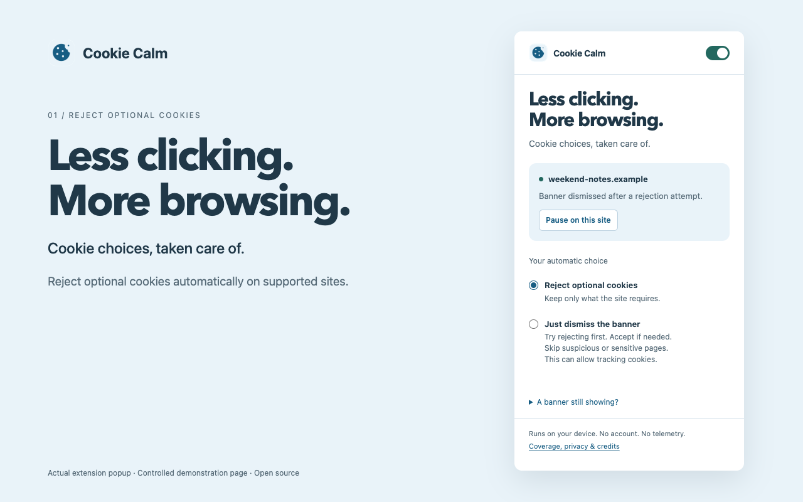

# Cookie Calm

Reject optional cookies and automatically dismiss supported website interruptions.

Cookie Calm is an open-source Chrome extension built on [Consent-O-Matic](https://github.com/cavi-au/Consent-O-Matic).
It adds promotional dismissal, a compact popup, local rules, site pauses, and checks before automatic actions.



## What it does

- Rejects optional cookies by default through recognized controls and provider rules.
- Turns on the supported Sourcepoint US sale/sharing opt-out before saving the choice.
- Automatically closes or minimizes supported newsletter, subscription, donation, discount, survey, app, notification, and chat prompts.
- Dismisses recognized optional registration invitations through safe close controls across sites.
- Collapses the Guardian support banner through its native control.
- Closes recognized inactive floating video prompts. Playing or previously played media stays available.
- Offers an optional acceptance fallback for cookies after rejection attempts fail.
- Stops automatic clicks when local checks find certain suspicious instructions.
- Blocks acceptance around password, payment, wallet, and software download prompts.
- Supports delayed banners, embedded frames, and shadow DOM.
- Finds supported promotional overlays from their controls and layout, including unfamiliar class names.
- Uses one guarded action engine for three consent providers and native promotional dismissal.
- Shows recent local results, with separate states for a closed panel and a recorded privacy choice.
- Preserves protected forms and recognized user-opened prompts.
- Restores extension-hidden app banners when paused.
- Runs locally without telemetry, accounts, remote AI, or automatic rule downloads.

The popup includes a global switch and an exact-hostname pause control. Pauses also apply to embedded consent frames.

## Install

Version 1.2.0 adds a shared prompt engine, broader promotional detection, and clearer result reporting. Download the latest package from GitHub below. Chrome Web Store updates require a separate review; see the [submission status](store/SUBMISSION.md).

1. Download the extension ZIP from [Releases](https://github.com/davegoldblatt/cookie-calm/releases/latest).
2. Extract the ZIP to a permanent folder.
3. Open `chrome://extensions` in Chrome.
4. Enable **Developer mode**.
5. Select **Load unpacked**.
6. Select the extracted folder that contains `manifest.json`.
7. Reload tabs that were open before installation.

Keep the extracted folder in place. Chrome loads unpacked extensions from that location.

## Choices and limits

**Reject optional cookies** uses recognized rejection buttons and consent rules. Unknown forms stay visible.

**Allow acceptance if needed** tries rejection first. If rejection fails, it can use a recognized acceptance button. This can allow tracking.

Scam checks use local heuristics and some English phrases. They can miss scams or stop on legitimate pages. They do not certify websites.

Public HTTP pages and internationalized domains cannot use the acceptance fallback. Loopback addresses remain available for local development.

A checkmark means that a supported banner disappeared or a collapse state changed after an action. It does not prove that the site stored or honors the choice.

The popup reports a recorded choice only when a supported receipt changes after the action. Sourcepoint US supports this check. CookieYes and Cookiebot currently report closure without claiming a saved choice. No receipt proves that a website honors consent downstream.

Settings apply to new consent choices. They do not undo previous consent. The extension does not delete cookies or block trackers.

Promotional dismissal operates in both cookie modes. Dismissible subscription prompts use their close or minimize controls. Paid-only articles still require access.

In-page notification requests differ from Chrome permission prompts. Chrome notification and location prompts remain outside this release.

Generic promotion matching currently uses English labels. Prompts without a recognized category and safe close control stay visible. Site changes, delayed user flows without identifiable controls, and unusual embedded widgets can limit coverage. Chat handling is limited to proactive greetings without a composer or conversation. Promotion actions do not run in foreign-host frames.

Pausing restores elements hidden with extension-owned styles. Native website close actions can save preferences that Cookie Calm cannot undo.

See [adding prompt categories](docs/ADDING-PROMPT-CATEGORIES.md) for the shared detection, safety, action, and verification pipeline.
The [shared engine design](docs/SHARED-PROMPT-ENGINE.md) explains provider adapters, permission polarity, and unsupported controls.

The bundled rules need release updates as websites change. Unpacked installations require manual updates.

## Existing alternatives

This is an existing category. [Consent-O-Matic](https://consentomatic.au.dk/) is the closest open-source alternative and supplies Cookie Calm's rule foundation.

[Super Agent](https://chromewebstore.google.com/detail/superagent-automatic-cook/neooppigbkahgfdhbpbhcccgpimeaafi) also applies saved preferences to supported consent forms.

[I still don't care about cookies](https://github.com/OhMyGuus/I-Still-Dont-Care-About-Cookies) focuses on removing cookie notices.

Cookie Calm's main additions are local packaging, simplified controls, guarded actions, and an explicit acceptance fallback.

## Privacy

Cookie Calm reads page text, consent controls, and addresses locally to perform its features. It also observes interaction events to protect active forms and user-opened prompts. It records no typed values and transmits none of this data to the maintainer.

Settings stay in local extension storage. Temporary tab status stays in session storage. Website consent controls can send their normal requests.

Read the [privacy policy](PRIVACY.md) for the data categories, retention, and contact details.

## Build and test

Requires Node 22 or later and Python 3.

```sh
git clone https://github.com/davegoldblatt/cookie-calm.git
cd cookie-calm
npm ci --ignore-scripts
PLAYWRIGHT_SKIP_BROWSER_GC=1 npx playwright install chromium
npm test
npm run package
```

The build writes an unpacked extension to `extension/`. Packaging writes a Chrome Web Store ZIP to `dist/` with `manifest.json` at its root.

Playwright tests load the actual extension into isolated Chromium profiles. Fixtures cover consent flows, false positives, cancellation, frames, and guards.

See the [annoyance implementation plan](ANNOYANCES-PLAN.md) and [validation](VALIDATION.md), [independent audit](AUDIT.md), [contribution instructions](CONTRIBUTING.md), and the [store submission guide](store/SUBMISSION.md).

## Credits and license

MIT license. See [LICENSE](LICENSE) and [NOTICE.md](NOTICE.md).

The bundled Consent-O-Matic snapshot contains 203 rule files, merged into 202 named definitions. Its original license remains included.

Cookie Calm is an independent derivative. It is not affiliated with or endorsed by Aarhus University or the Consent-O-Matic authors.
